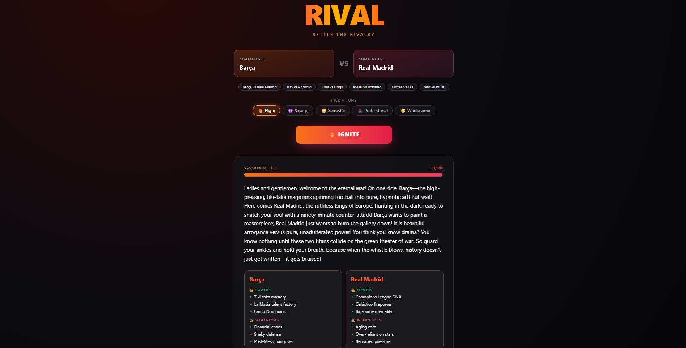
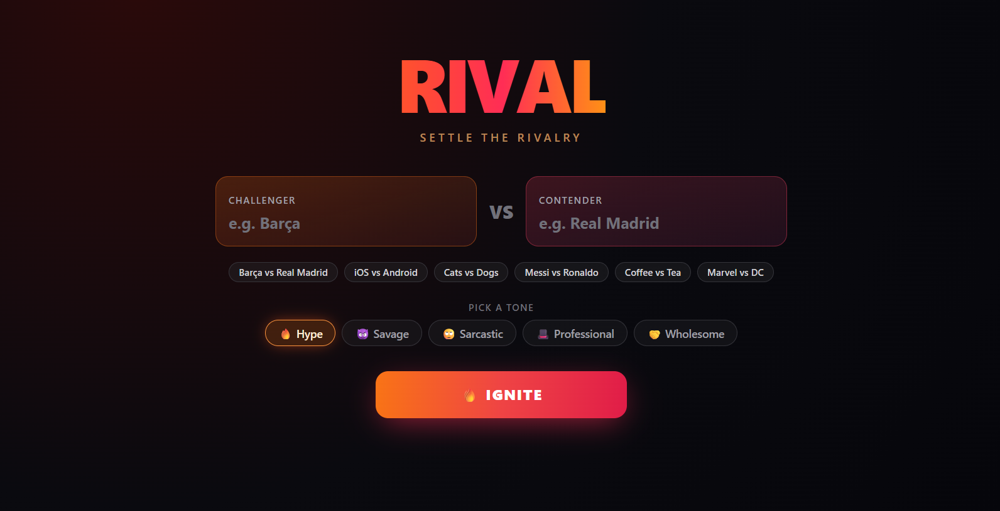
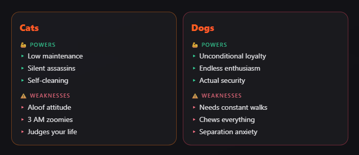
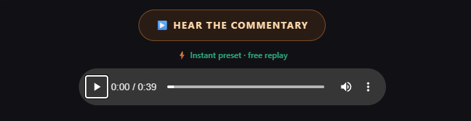
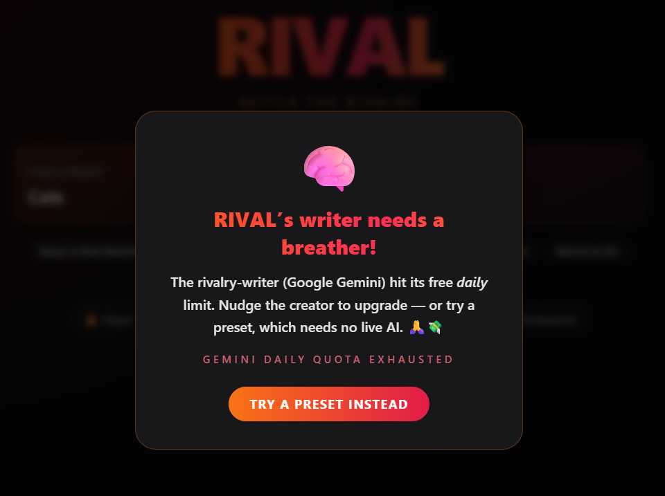

<div align="center">

# 🔥 RIVAL

### Settle the rivalry.

Pick **any two rivals** — real or fictional, living or non-living, serious or completely ridiculous. RIVAL writes fiery trash-talk, scouts each side's **powers & weaknesses**, crowns a **winner**, and then **reads the whole thing out loud** like a dramatic sports commentator.


**[🔴 Live Demo](https://rivals-tau.vercel.app/) · [📖 Read the story](https://dev.to/blackwatch021/rival-i-built-an-ai-that-settles-any-rivalry-out-loud-3hkc) · [🎬 Watch the demo](https://www.youtube.com/watch?v=zhl_VvIZPkk)**



</div>

---

## ✨ What it does

- 🥊 **Any matchup** — `Goku vs Naruto`, `iOS vs Android`, `Cats vs Dogs`, `Coffee vs Tea`… if you can name two things, you can pit them.
- ✍️ **Fiery AI monologue** that trash-talks _and_ hypes both sides.
- 💪 **Scouting cards** — Powers & Weaknesses for each contender.
- 🏆 **A winner + a bold prediction**, plus a **passion meter** for the beef.
- 🎙️ **Dramatic spoken commentary** — the verdict, read aloud.
- 🎭 **Five tones** — Hype, Savage, Sarcastic, Professional, Wholesome.
- ⚡ **Six instant presets** that play with zero API calls.

## 🖼️ Screenshots

<table>
  <tr>
    <td width="50%"></td>
    <td width="50%"></td>
  </tr>
  <tr>
    <td align="center"><em>Two rivals, six presets, five tones, one big red button.</em></td>
    <td align="center"><em>Every side gets scouted — powers & weaknesses.</em></td>
  </tr>
  <tr>
    <td width="50%"></td>
    <td width="50%"></td>
  </tr>
  <tr>
    <td align="center"><em>~40 seconds of dramatic, spoken-word commentary.</em></td>
    <td align="center"><em>Out of free-tier quota? Fail with a smile.</em></td>
  </tr>
</table>

## 🧠 How it works

Two server-side **Route Handlers** do all the sensitive work, so the API keys **never** touch the browser — the frontend only ever calls _this app's own_ endpoints:

| Endpoint | Powered by | Job |
| --- | --- | --- |
| `POST /api/generate` | **Google Gemini** | Writes the monologue, the short spoken version, powers/weaknesses, winner, prediction & passion score — as structured JSON, steered by the chosen tone. |
| `POST /api/voice` | **ElevenLabs** | Turns the short spoken version into expressive commentator audio (MP3). |

## 🛠️ Tech

- **Next.js** (App Router) + **TypeScript** + **Tailwind CSS**
- Server Route Handlers in `app/api/generate` and `app/api/voice`
- Shared logic in `lib/` (`gemini.ts`, `tones.ts`)
- Deployed on **Vercel**

## 🧩 A few fun engineering bits

- **The "thinking model" trap.** Gemini kept returning truncated JSON — the reasoning tokens were eating the whole budget. Setting `thinkingConfig: { thinkingBudget: 0 }` and giving it room fixed it instantly.
- **Two versions of every take.** Gemini returns a full on-screen monologue _and_ a tight ~40-second spoken version. Only the short one is voiced — roughly **4× cheaper** on ElevenLabs characters (~2,000 → ~340 per go).
- **Zero-cost presets.** The six preset matchups are pre-generated (text _and_ audio) into static files under `public/presets/`, served from a manifest with **no live API calls** — instant, free, and infinitely replayable.
- **Free-tier voice.** Library voices (e.g. "Rachel") return `402` on the free tier; the default is a premade broadcaster voice ("Daniel") that works — and suits a commentator anyway.
- **Failing with a smile.** When a quota runs out, the app shows a friendly popup and nudges you toward a preset instead of throwing a raw error.

## 🚀 Run locally

```bash
npm install
cp .env.local.example .env.local   # then fill in your keys
npm run dev                        # http://localhost:3000
```

### Environment variables

| Variable | Required | Notes |
| --- | --- | --- |
| `GEMINI_API_KEY` | ✅ | [Google AI Studio](https://aistudio.google.com/apikey) |
| `GEMINI_MODEL` | — | Defaults to `gemini-flash-latest` |
| `ELEVENLABS_API_KEY` | ✅ | [ElevenLabs](https://elevenlabs.io) → Profile → API key |
| `ELEVENLABS_VOICE_ID` | — | Defaults to `onwK4e9ZLuTAKqWW03F9` ("Daniel") |

> Keys are **never** prefixed `NEXT_PUBLIC_`, and `.env.local` is git-ignored — nothing sensitive reaches the client bundle.

### Rebuilding the presets (optional)

```bash
node scripts/build-presets.mjs      # regenerates preset text + audio (spends API quota)
node scripts/augment-presets.mjs    # backfills powers/weaknesses (Gemini only)
```

## 🏆 Built for

The [**DEV Weekend Challenge: Passion Edition**](https://dev.to/challenges/weekend-2026-07-09) — targeting **Best Use of Google AI** (Gemini writes it) and **Best Use of ElevenLabs** (it voices it).

<div align="center">

**Now go settle something ridiculous.** 🦇🐱

</div>
